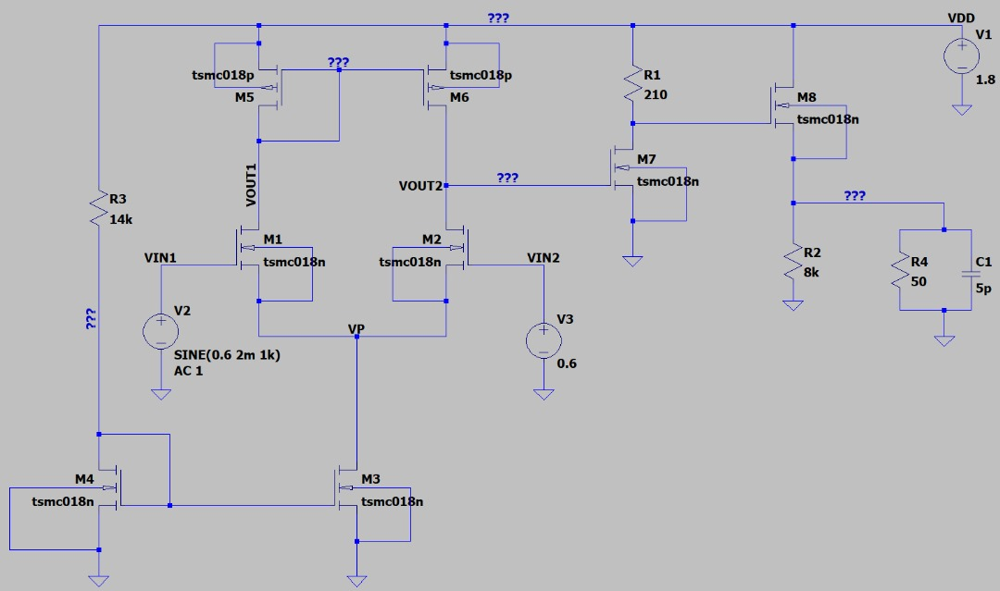

# Analog Integrated Circuit Systems - Study Materials

Welcome to this collection of study materials for Analog Integrated Circuit Systems (AICS). This repository aims to provide helpful resources for students learning about the design and analysis of analog ICs.

## Content Overview

This repository contains chapter notes covering key topics in AICS.

### Course Outline

* [AICS - Outline](./AICS%20-%20Outline.pdf) - General overview of the topics covered.

### Chapters

1.  **Basic MOS Device Physics and Models**
    * [Chapter 1 Notes](./Chapter%201%20-%20Basic%20MOS%20Device%20Physics%20and%20Models.pdf)
2.  **Single-Stage Amplifiers**
    * [Chapter 2 Notes](./Chapter%202%20-%20Single-Stage%20Amplifiers.pdf)
3.  **Differential Amplifiers**
    * [Chapter 3 Notes](./Chapter%203%20-%20Differential%20Amplifiers.pdf) 4.  **Current Mirrors**
    * [Chapter 4 Notes](./Chapter%204%20-%20Current%20Mirrors.pdf)
5.  **Frequency Response of Amplifiers**
    * [Chapter 5 Notes](./Chapter%205%20-%20Frequency%20Response%20of%20Amplifiers.pdf)
6.  **Feedback in Amplifiers**
    * [Chapter 6 Notes](./Chapter%206%20-%20Feedback%20in%20Amplifiers.pdf)

## How to Use

Simply navigate to the chapter you are interested in and click the link to view or download the PDF file.

## Disclaimer

**Important:** Please ensure you have the necessary rights and permissions before distributing copyrighted material. These documents are provided for educational purposes. If you are the copyright holder and believe this material infringes upon your rights, please open an issue in this repository.

*(Optional: Add a sentence about the source, e.g., "These notes are based on the curriculum from [University/Course Name]" - only if accurate and appropriate).*

## Contributing

*(Optional: If you want others to contribute)*
Feel free to fork this repository, add your own notes or resources (e.g., simulation files, problem sets, corrections), and submit a pull request. Please ensure any contributed material adheres to copyright regulations.

---

---

## Multistage Amplifier Design Example (TSMC 0.18µm)

This section details a design example or assignment for a multi-stage operational amplifier, implemented using the TSMC 0.18µm CMOS process.

### Schematic


*(Image: multistage-amplifier-schematic.png - Uploaded to the repository)*

### Design Specifications

The goal was to design an open-loop amplifier driving a **5 pF || 50 Ω load** with the following targets:

| Specification              | Target                               | Achieved                |
| :------------------------- | :----------------------------------- | :---------------------- |
| Supply Voltage (VDD)     | 1.8 V                                | 1.8 V                   |
| DC Power Consumption (Pdc) | ≤ 20 mW                              | **15.534 mW** |
| Input Signal (Vin)       | 2 mVp @ 1kHz (DC offset 0.6V)        | Used for simulation     |
| Open Loop Gain (Av)        | 35 dB - 38 dB                        | **35.079 dB** |
| Open Loop Bandwidth (f3dB) | ≥ 200 kHz                            | **~78.94 MHz** (*)      |
| Biasing                  | Must use current mirrors             | Implemented (M3/M4)     |

(*) *Bandwidth measured at Av(DC) - 3dB = 35.079 - 3 ≈ 32 dB.*

### Components & Configuration

* **Technology:** TSMC 0.18µm (`.lib TSMC_models.txt`)
* **Supply:** VDD (V1) = 1.8V
* **Input Signal (V2):** SINE(0.6V DC, 2mV Amplitude, 1kHz Freq), AC = 1
* **Input Bias (V3):** 0.6V DC
* **Resistors:** R1=210Ω, R2=8kΩ, R3=14kΩ, R4=50Ω
* **Load Capacitor:** C1=5pF

**Transistor Sizing (L = 0.18µm for all):**

| Transistor | Model    | Width (W) | Role                 |
| :--------- | :------- | :-------- | :------------------- |
| M1         | tsmc018n | 25µm      | Input Diff Pair    |
| M2         | tsmc018n | 25µm      | Input Diff Pair    |
| M3         | tsmc018n | 150µm     | Current Mirror Ref |
| M4         | tsmc018n | 5µm       | Current Mirror Bias|
| M5         | tsmc018p | 6µm       | Active Load/Cascode|
| M6         | tsmc018p | 6µm       | Active Load/Cascode|
| M7         | tsmc018n | 44µm      | Source Follower    |
| M8         | tsmc018n | 180µm     | Output Stage       |

### Simulation Setup Hints (SPICE)

```spice
.lib TSMC_models.txt
.op                 ; DC Operating Point Analysis
.tran 5m            ; Transient Analysis (example: 5ms duration)
.dc V2 0 1.8 0.01   ; DC Sweep (example: sweep V2)
.ac dec 100 1 1g    ; AC Analysis (Frequency Response: 100 points/decade, 1Hz to 1GHz)


